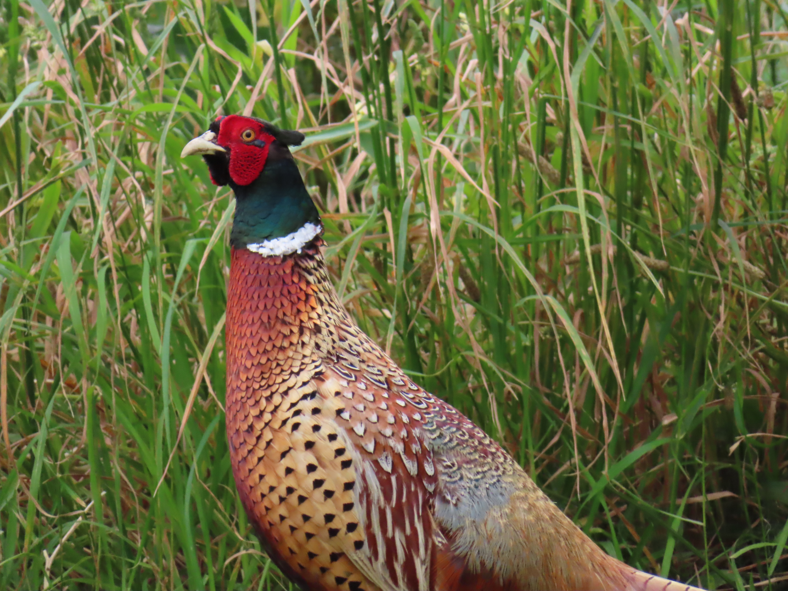
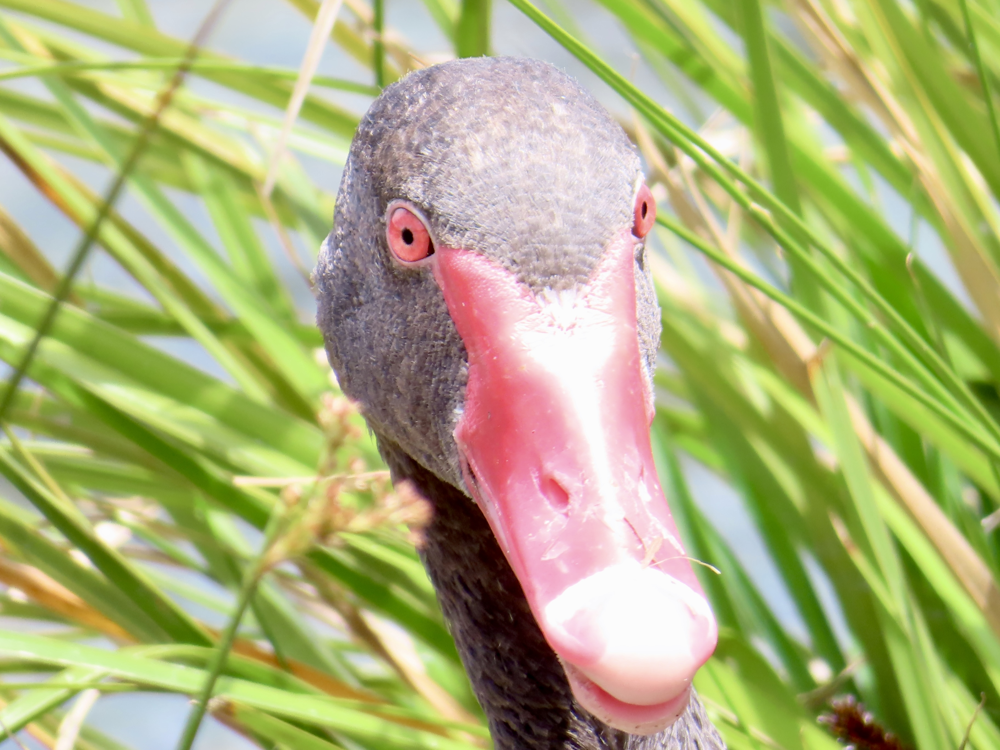
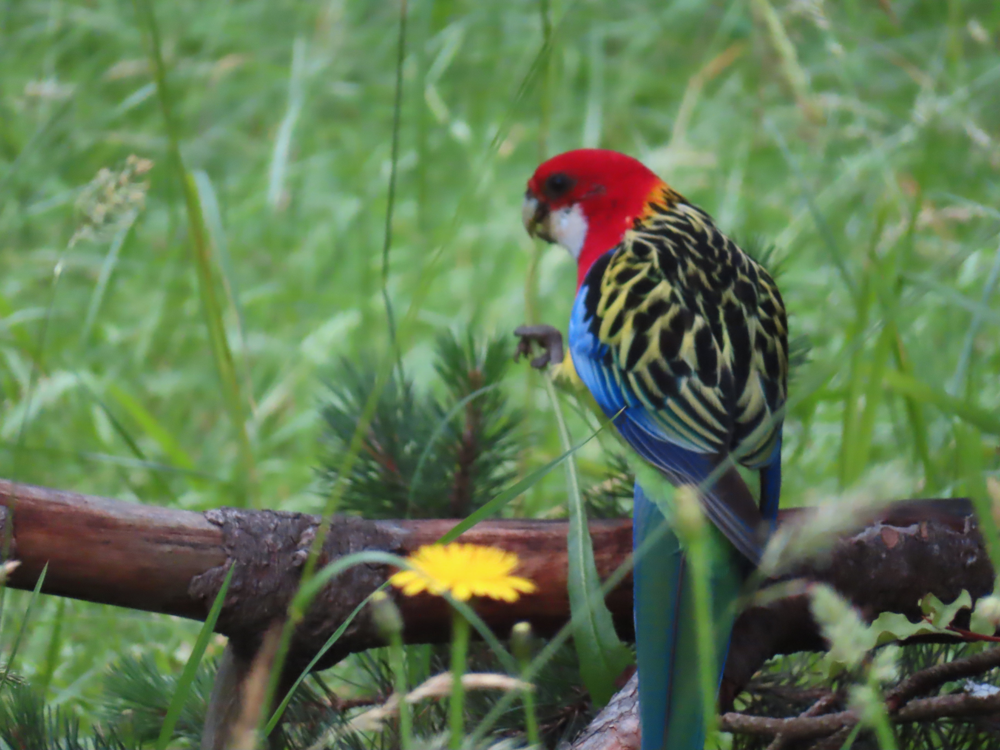
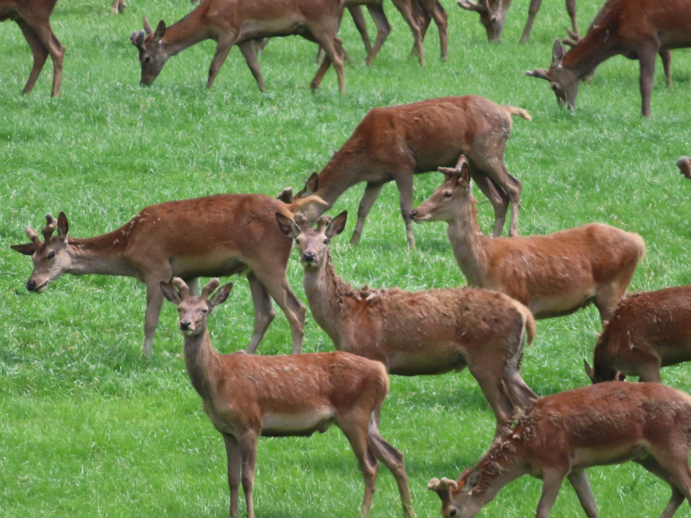
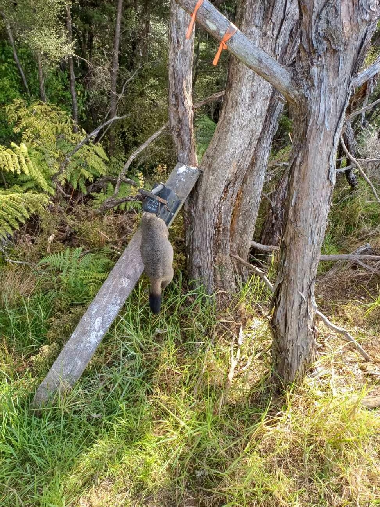
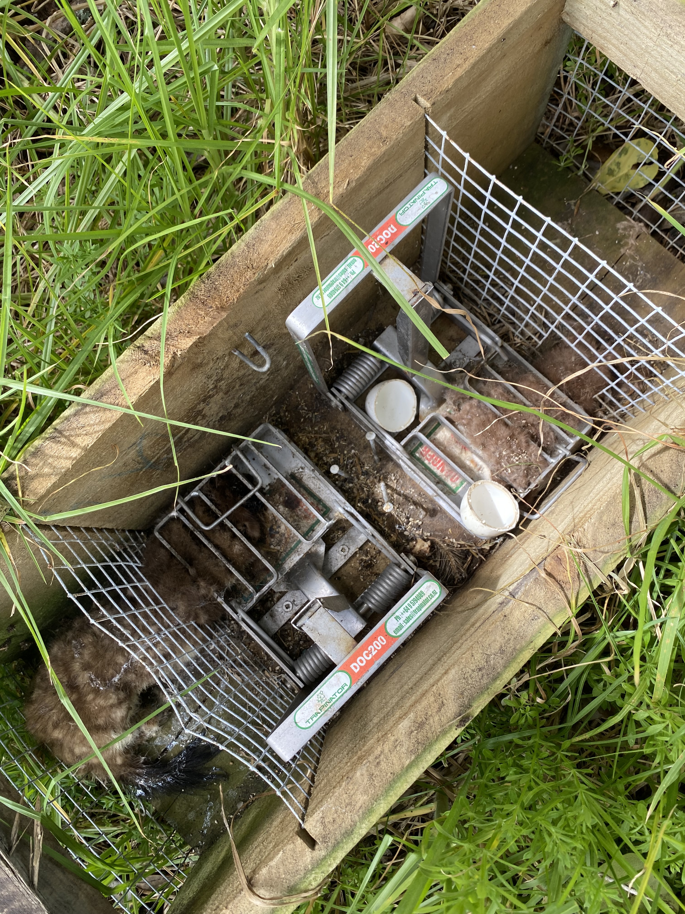
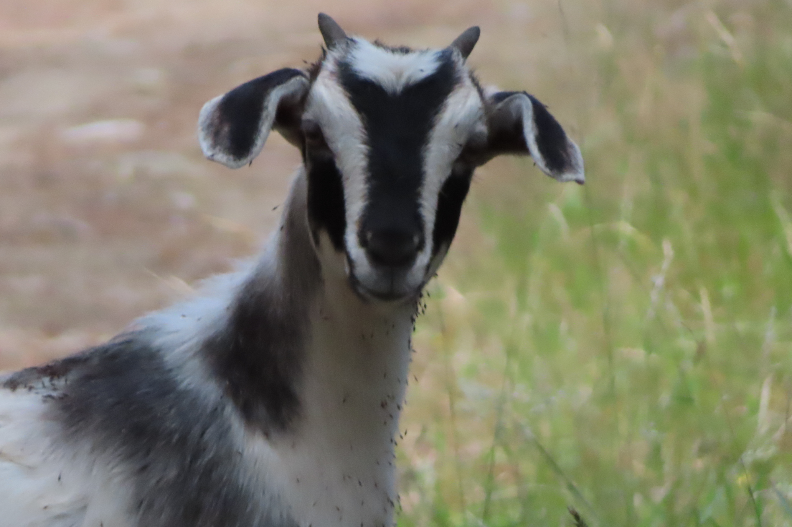
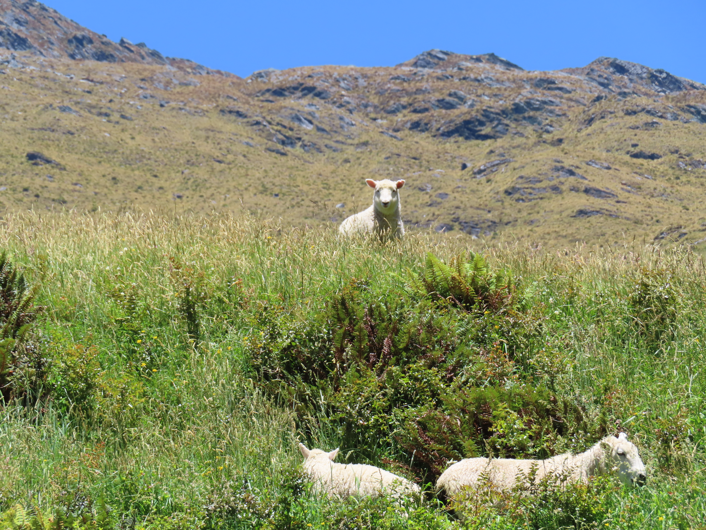
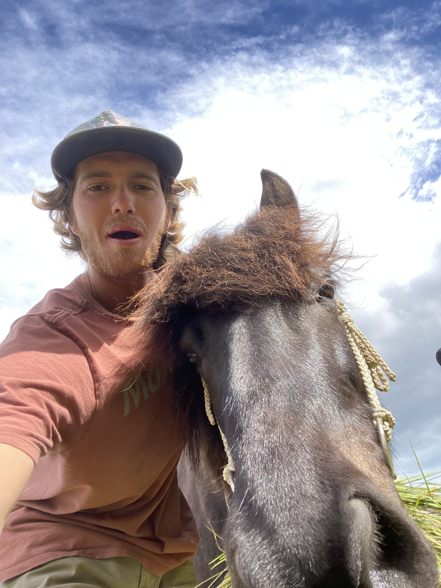
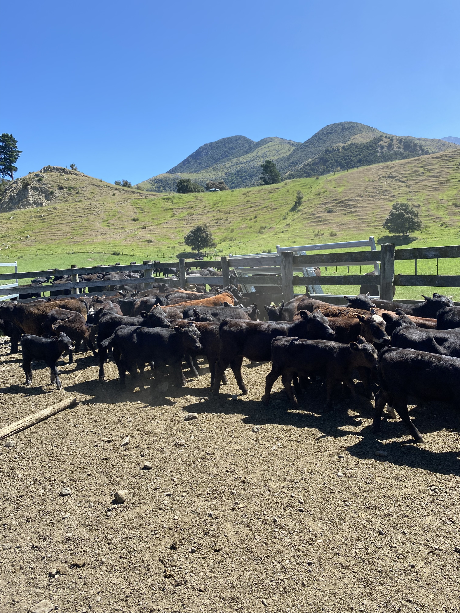

## Introduced Birds: 

### Ring-necked Pheasant: 

### I saw a bright pink pheasant at one point on the side of the road and I have no clue what it was. 

### Black Swans:

### Aggressive and protective birds that have taken over some ponds 

###  Eastern Rosella Parrot:

### Escapees that threaten local food webs. Photo captured in the Dunedin Botanical Gardens 

# Introduced/Invasive Mammals: 

### Deer for both livestock and hunting are a frequent sight driving through the country. 

### Brush Tail Possum:

### One of, if not the most destructive invasive mammal eating both native vegetation and bird eggs. 

### Stoat: 

### The other horrific introduction that breeds faster than it can eat birds and their eggs. 

### Goat:

### Invasive goats are reguarly culled through DOC efforts in national parks and I met a crew accessing the Abel Tasman through Andrew's adjacent land. 

## Livestock: 

### Sheep

### Icelandic Horse

### Cattle
