```         
```

## 

# Natives species from Tiritiri Matangi Conservation Island:

#### October 2024

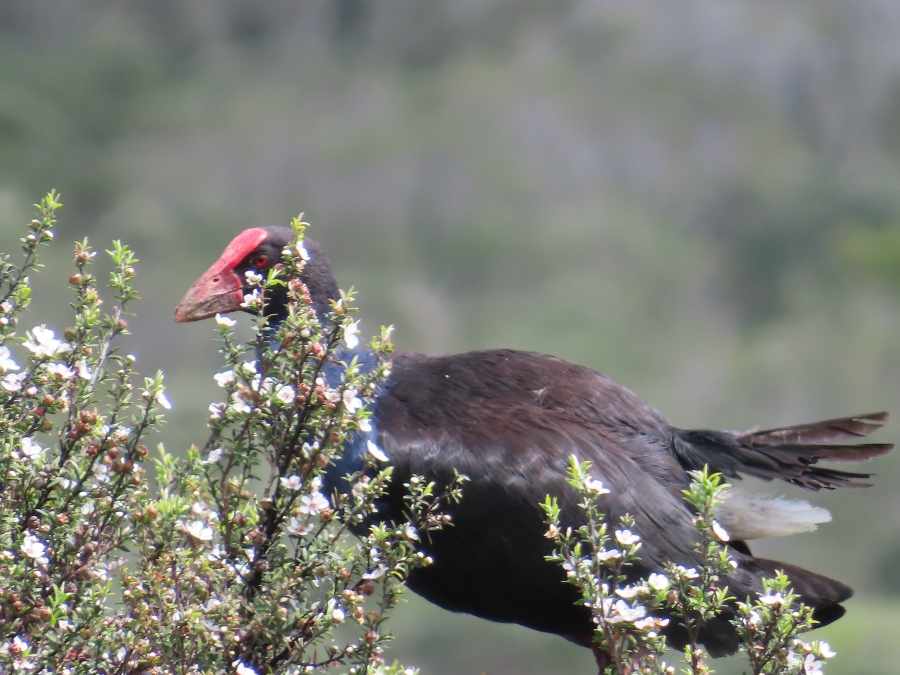

### Pūkeko:

### Seen throughout both North and South islands particularly in wetland ecosystems.

#### Prehistoric looking beaks. Unfortunately involved in road collisions often

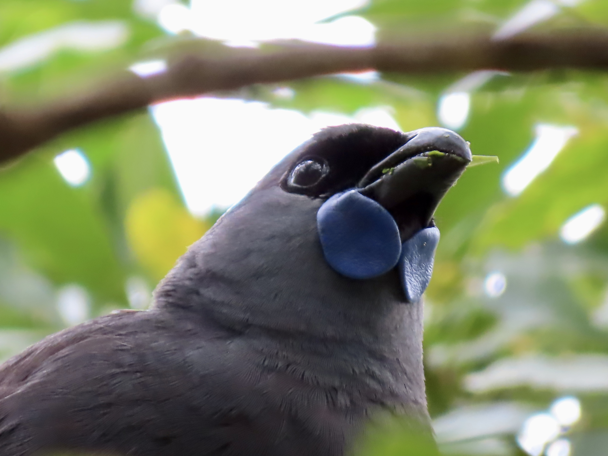

### Kōkako:

### Highly endangered and is the subject of robust conservation projects around the country

#### I was excited to see this rare bird happily eating on this conservation island

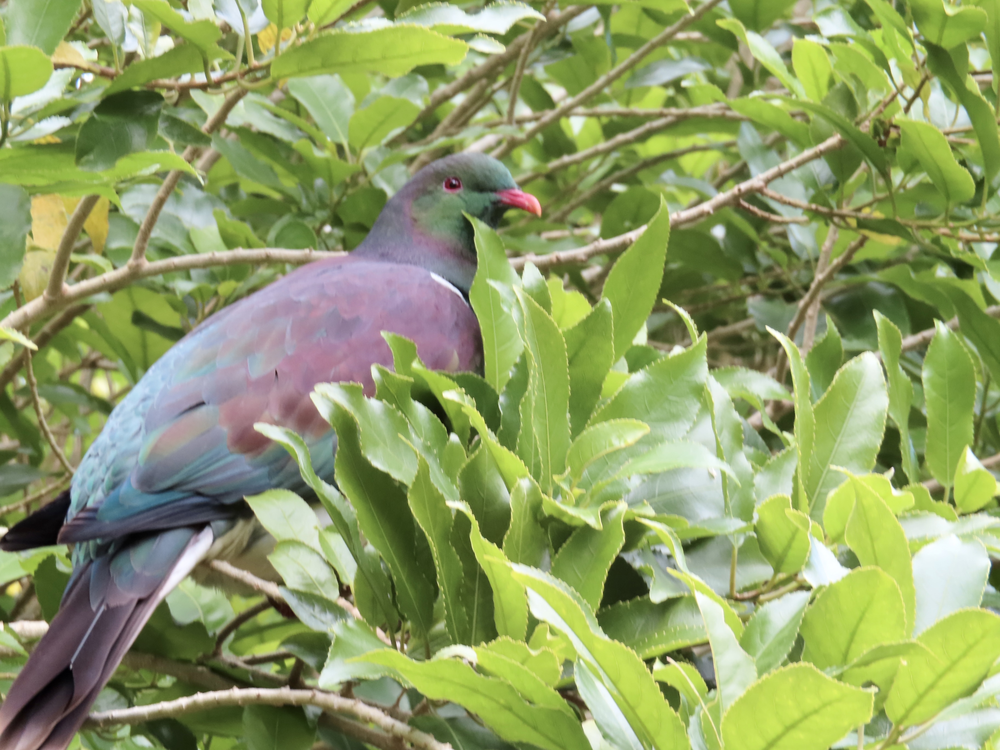

### Kererū:

### Endemic bird that was hunted heavily for human consumption.

#### Vertical spiral mating rituals and have amazing silhouettes in the evening

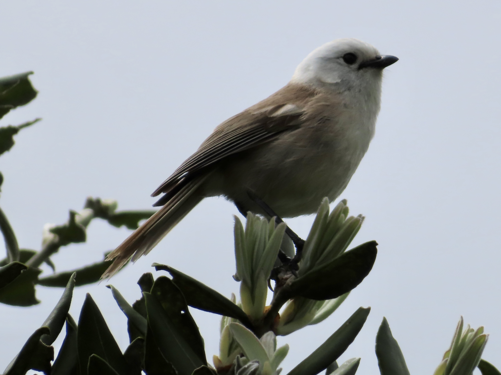

### Pōpokotea (Whitehead):

### Very Small specialized habitat for the Whitehead

#### Blended into the kānuka bush flowers

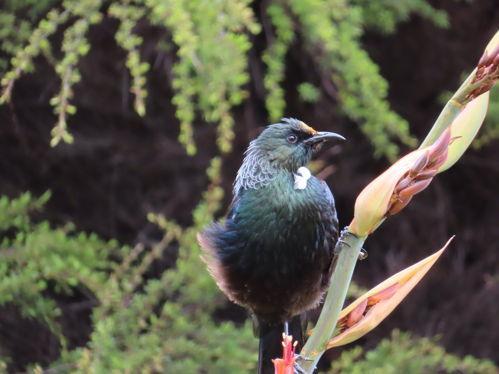

### Tūī:

### Seen everywhere and constantly singing

#### The orange on this tui is pollen stuck on the feathers near its beak

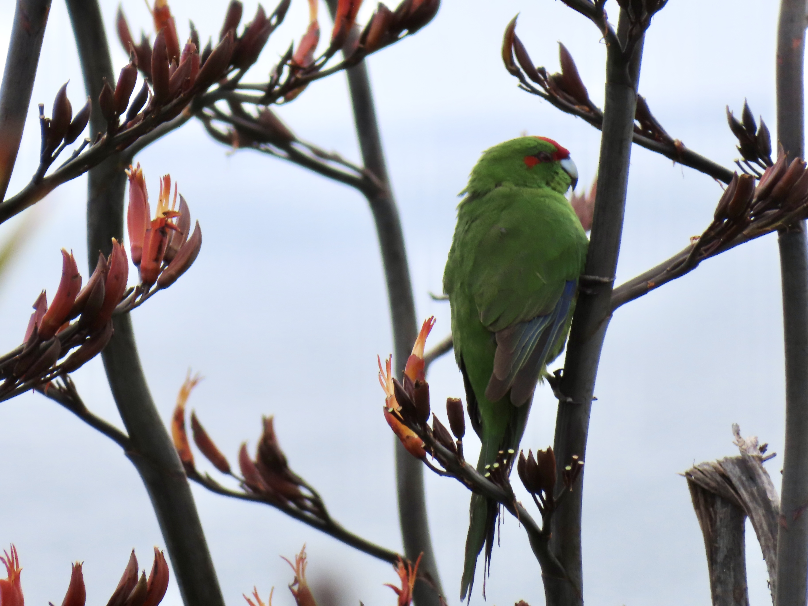

### Kākāriki (Red-crowned Parakeet):

### Captive breeding population seen on Tiritiri Matangi and waited for hours in the flax to photograph

#### Very chatty and amazing bright spectrum of colors as they fly.

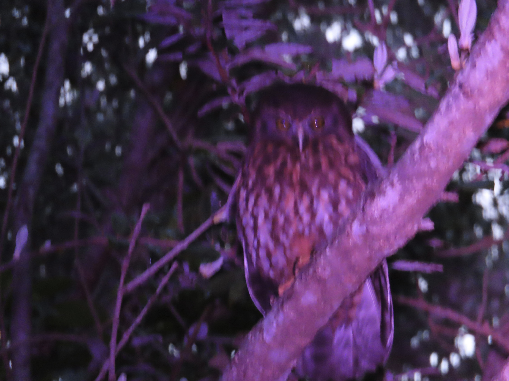

### Ruru (morepork owl):

### This owl is quite a compelling create and holds much spiritual power in New Zealand

#### This one was seen right along a trail looking to hunt

# The two Endemic New Zealand Parrots:

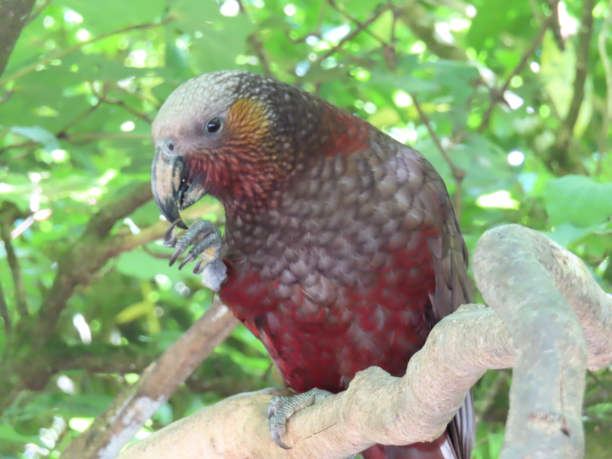

### Kākā:

### Seen in Zealandia Eco-Sanctuary cracking open large nuts

#### The population in Zealandia left one day and returned to the sanctuary with birds from Napier

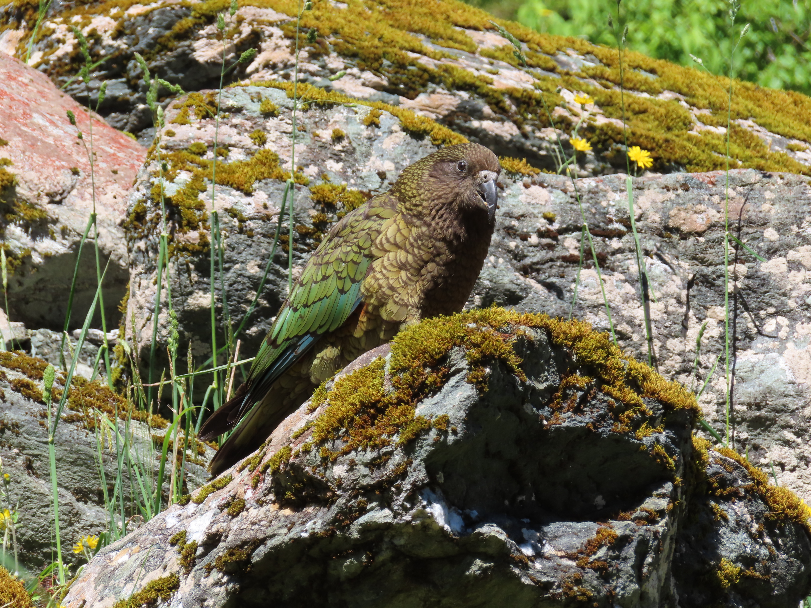

### Kea:

### The only alpine parrot in the world that is known for getting right into people's windows

#### This photo doesn't do the Kea justice since it hides the the red/orange feathers under its wings

# Other Natives Seen throughout the Country:

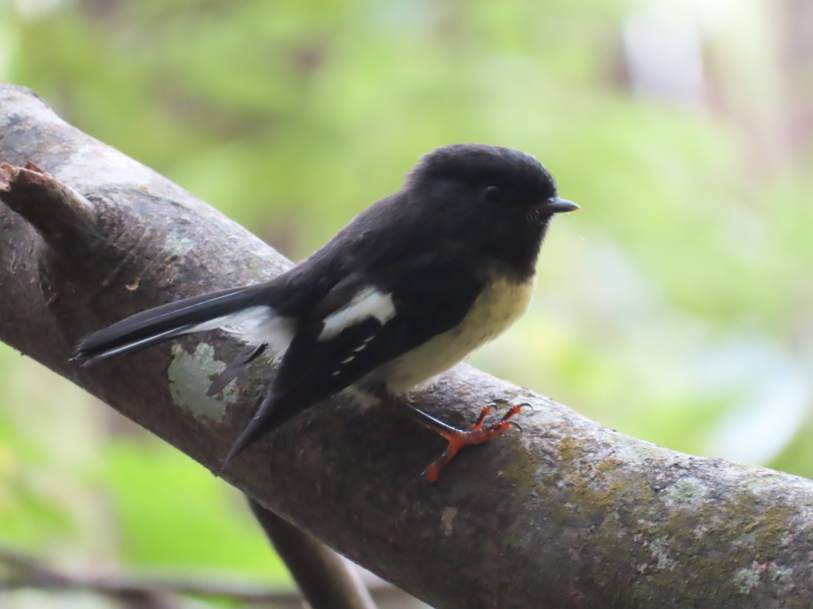

### New Zealand tomtit:

### Seen on a hike outside Dunedin and was not scared of people

#### Final version of this photo helped me learn many editing tools since the eye is invisible.

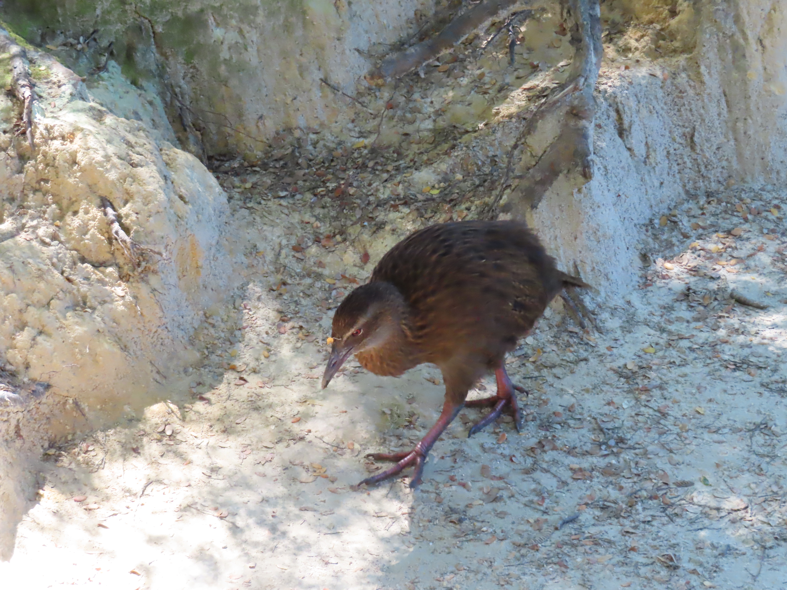

### Weka:

### Seen often around campsites these flightless birds will be quite bold

#### They are always mistaken as kiwis which is crazy to me

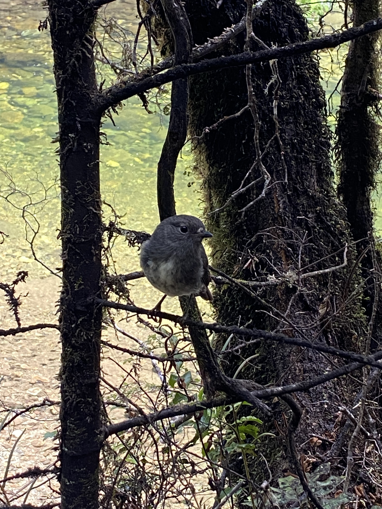

### South Island Robin:

### This species of bird was always interested in people especially in the back country

#### I think it used to follow around moa birds and eat the seeds they dropped

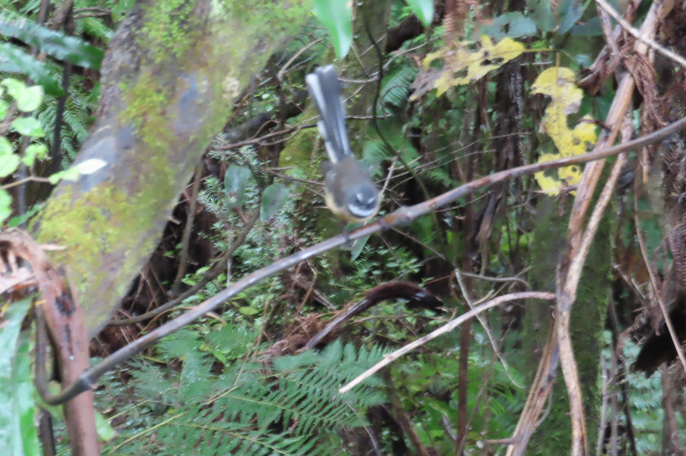

### New Zealand Fantail:

### A highly energetic bird that is seen throughout all landscapes and human gardens.

#### I had a poster with a fantail and other NZ species in my room my whole life
